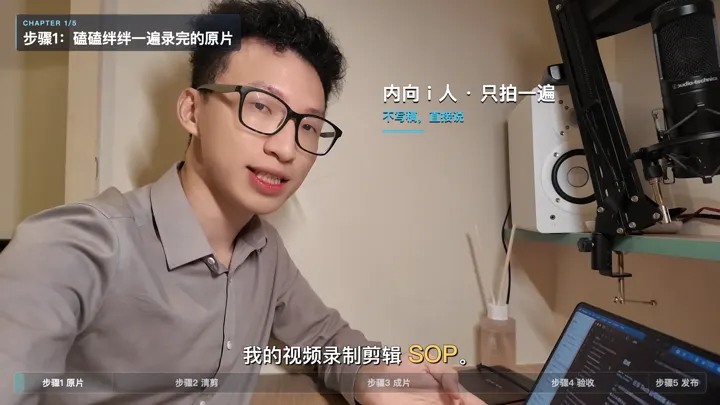
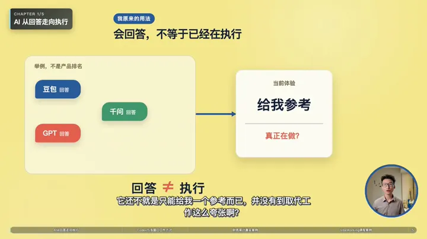
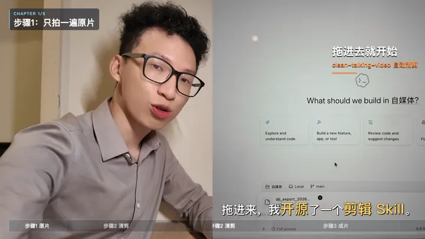
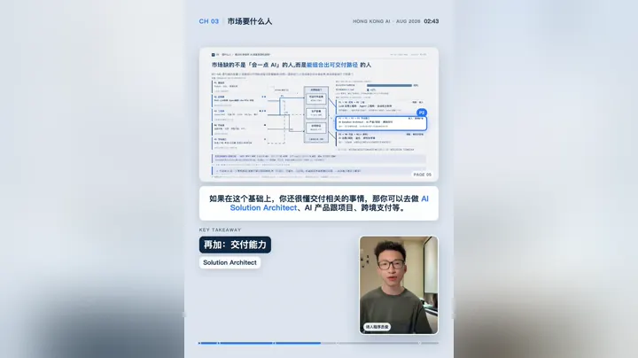

[简体中文](README.md) | [English](README_EN.md)

# MotionTalk

把精剪视频和最终 SRT 交给 Codex、Kimi 或 Claude Code，再说几句你想要的效果。
MotionTalk 会看完内容、提出导演方案，并在你确认一次后完成制作和交付。

## 和 AI 说几句话就行

你不需要懂视频工程，也不用填写复杂参数。把素材给 Codex / Kimi / Claude Code，
像和剪辑师沟通一样描述想法就行：横屏还是竖屏、人物放哪里、是否加入 PPT 或
录屏、字幕想要什么感觉，都可以直接说。

**给 AI 视频和字幕，说几句想要的效果 → AI 给出导演方案 → 收到最终成片 →
调整（可选）**


例如只需要说：

```text
用 MotionTalk 处理这条视频和对应字幕。人物、全屏 MG 与其它视频b-roll素材按内容在你觉得合适的时候切换或者交错。
```

方案确认后，AI 会连续制作、检查并交付最终成片。满意即可结束；想微调就继续用
自然语言告诉它。

## 参考主题

下面四个效果是独立参考 Prompt 中提供的起点。点名其中一个，可以
**快速生成相似视频**；它们不是四选一，也不是 MotionTalk 的能力边界。实际想要
什么布局、字幕、人物、录屏或动画效果，都可以直接用自然语言和 AI 说。以下均为
真实交付样片。

<table>
  <tr>
    <td width="50%"><br><strong>1. floating-overlay</strong><br><sub>人物或录屏全屏常驻，MG 只在安全区做轻量强调。</sub></td>
    <td width="50%"><br><strong>2. mg-with-presenter-window</strong><br><sub>MG、截图或录屏成为主画面，人物以圆窗或方窗陪伴。</sub></td>
  </tr>
  <tr>
    <td width="50%"><br><strong>3. switching</strong><br><sub>人物、全屏 MG 与录屏按内容切换，各自获得完整阅读空间。</sub></td>
    <td width="50%"><br><strong>4. PPT Focus Portrait</strong><br><sub>竖屏 PPT 主视觉，PPT 下自适应双行字幕，右下人物与底部进度。</sub></td>
  </tr>
</table>

四个效果的参考指引统一放在
[`references/04-reference-theme-prompt.md`](references/04-reference-theme-prompt.md)。
它只帮助 AI 快速理解方向；最终导演计划仍由当前素材和自然语言要求决定。

## 核心能力

- **先理解，再设计**：AI 会先看完整视频和字幕，不是随机添加特效；
- **一次确认，连续交付**：导演方案确认后，制作过程中不再反复打断；
- **每条视频单独设计**：画面跟着内容和你的要求走，不套固定模板；
- **交付前自动检查**：检查字幕、人物比例、遮挡、素材对应关系和最终成片；
- **参考主题 Prompt**：用四个真实效果快速对齐方向，也可以完全跳过主题，直接
  用自然语言设计当前项目。

## 安装

```bash
npx skills add PoetCoderJun/MotionTalk
```

## 开发验证

```bash
python3 -m unittest discover -s tests -v
node scripts/render_master.mjs --help
node scripts/validate_master.mjs --help
```

## 许可

仓库原创内容采用 [CC BY-NC-SA 4.0](LICENSE.md)，仅限非商业使用；商业使用需
另行获得书面许可。
