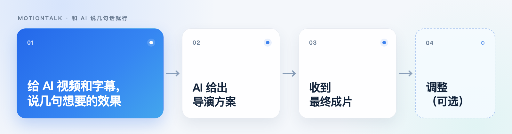

[简体中文](README.md) | [English](README_EN.md)

# MotionTalk

把精剪视频和最终 SRT 交给 Codex、Kimi 或 Claude Code，再说几句你想要的效果。
MotionTalk 会看完内容、提出导演方案，并在你确认一次后完成制作和交付。

## 和 AI 说几句话就行

你不需要懂视频工程，也不用填写复杂参数。把素材给 Codex / Kimi / Claude Code，
像和剪辑师沟通一样描述想法就行：横屏还是竖屏、人物放哪里、是否加入 PPT 或
录屏、字幕想要什么感觉，都可以直接说。

**给 AI 视频和字幕，说几句想要的效果 → AI 给出导演方案 → 收到最终成片 →
调整（可选）**



例如只需要说：

```text
用 MotionTalk 处理这条视频和对应字幕。人物、全屏 MG 与其它视频b-roll素材按内容在你觉得合适的时候切换或者交错。
```

方案确认后，AI 会连续制作、检查并交付最终成片。满意即可结束；想微调就继续用
自然语言告诉它。

## 第一次使用

1. 先看下方四个[现有样片](#参考主题)，确定想要的画面方向；它们是视觉参考，不是可一键运行的完整示例工程。
2. 准备一条已精剪、可解码的视频及与它匹配的最终 SRT。只有原始口播时，先用 [clean-talking-video](https://github.com/PoetCoderJun/clean-talking-video)；MotionTalk 不负责转写或重剪。
3. [安装 Skill](#安装)，把两个素材的路径和独立输出目录交给 Agent。例如：

```text
用 $motiontalk 处理：
- video: /data/edited-video.mp4
- subtitles: /data/final-clean.srt
- output_dir: /work/motiontalk-demo
使用 floating-overlay 作为参考。先给我审阅导演计划，批准后再制作。
```

Agent 会先交付人读导演脚本与机器计划。明确批准当前计划后才进入制作；“你自行判断”仅授权草案。输入、时间线、文案或冻结视觉方向变化时，需要重新规划与批准。最终交付包装成片、导演脚本、计划和质量报告。

只想先检查工程逻辑，无需视频或模型调用：运行[合成计划样例](examples/plan-validation/README.md)。它展示通过、未批准与时间线缺口三种情况，不代表成片演示。

## 参考主题

下面四个效果是独立参考 Prompt 中提供的起点。点名其中一个，可以
**快速生成相似视频**；它们不是四选一，也不是 MotionTalk 的能力边界。实际想要
什么布局、字幕、人物、录屏或动画效果，都可以直接用自然语言和 AI 说。以下均为
真实交付样片。

<table>
  <tr>
    <td width="50%"><br><strong>1. floating-overlay</strong><br><sub>人物或录屏全屏常驻，MG 只在安全区做轻量强调。</sub></td>
    <td width="50%"><br><strong>2. mg-with-presenter-window</strong><br><sub>MG、截图或录屏成为主画面，人物以圆窗或方窗陪伴。</sub></td>
  </tr>
  <tr>
    <td width="50%"><br><strong>3. switching</strong><br><sub>人物、全屏 MG 与录屏按内容切换，各自获得完整阅读空间。</sub></td>
    <td width="50%"><br><strong>4. PPT Focus Portrait</strong><br><sub>竖屏 PPT 主视觉，PPT 下自适应双行字幕，右下人物与底部进度。</sub></td>
  </tr>
</table>

四个效果的参考指引统一放在
[`references/04-reference-theme-prompt.md`](references/04-reference-theme-prompt.md)。
它只帮助 AI 快速理解方向；最终导演计划仍由当前素材和自然语言要求决定。

## 核心能力

- **先理解，再设计**：AI 会先看完整视频和字幕，不是随机添加特效；
- **一次确认，连续交付**：导演方案确认后，制作过程中不再反复打断；
- **每条视频单独设计**：画面跟着内容和你的要求走，不套固定模板；
- **交付前自动检查**：检查字幕、人物比例、遮挡、素材对应关系和最终成片；
- **参考主题 Prompt**：用四个真实效果快速对齐方向，也可以完全跳过主题，直接
  用自然语言设计当前项目。

## 安装

```bash
npx skills add PoetCoderJun/MotionTalk
```

## 检查与限制

脚本会检查计划批准标记、时间线连续性、成片尺寸/帧率/时长、音频 codec，以及检查清单中的证据文件和状态。Agent 仍须逐帧判断画面语义、比例、遮挡与包装；检查通过不等于程序自动理解了画面，也不能证明每一帧都正确。

批准状态是计划中的字段，不是签名或输入哈希绑定。输入变更后退回规划是工作流规则。证据帧属于抽样，不能覆盖所有瞬时错误；成片验证也不证明主音频与原始音频逐样本相同。缺少依赖、素材或证据时应停止并说明原因。

完整制作需要能读文件与图像、执行命令的 Agent，以及 Python 3、Node.js/npm、项目内安装且版本一致的 Remotion 依赖。首次渲染可能下载浏览器与依赖；Skill 安装本身不会安装完整渲染环境。渲染在本机运行，素材仍可能由所用 Agent 服务处理。模型费用、机器性能与交付时间取决于环境，此仓库不提供成本或耗时保证。

工程读者可查看[Harness 案例与代码边界](docs/harness-case-study.md)。

## 开发验证

```bash
python3 -m unittest discover -s tests -v
node scripts/render_master.mjs --help
node scripts/validate_master.mjs --help
```

## 许可

仓库原创内容采用 [CC BY-NC-SA 4.0](LICENSE.md)，仅限非商业使用；商业使用需
另行获得书面许可。
