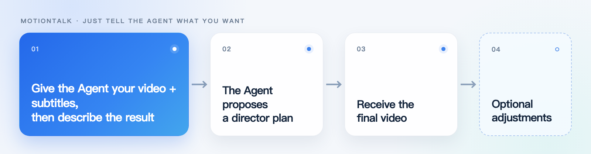

[简体中文](README.md) | [English](README_EN.md)

# MotionTalk

Give an edited video and its final SRT to Codex, Kimi, or Claude Code, then say
a few words about the result you want. MotionTalk reads the content, proposes a
director plan, and completes production after one approval.

## Just tell the Agent what you want

You do not need to understand video engineering or fill in complex parameters.
Give the assets to Codex / Kimi / Claude Code and describe the result as if you
were talking to an editor: landscape or portrait, presenter placement, PPT or
screen recording, caption feel, and any animation you want.

**Give the Agent your video and subtitles, then describe the result → The Agent
proposes a director plan → Receive the final video → Optional adjustments**



For example:

```text
Use MotionTalk for this video and its subtitles. Switch or interweave the
presenter, full-screen MG, and other video B-roll wherever you think it best
serves the content.
```

After approval, the Agent completes production, checks the result, and delivers
the final video. Stop when it feels right, or describe any adjustments in plain
language.

## Reference themes

The four effects below are starting points in one standalone reference prompt.
Naming one can quickly produce a similar video, but they are not a required
four-way choice or the boundary of MotionTalk. Describe the desired layout,
captions, presenter, screen recording, or animation directly in natural
language whenever you want a different result. Every frame is from a real local
delivery.

<table>
  <tr>
    <td width="50%"><br><strong>1. floating-overlay</strong><br><sub>Keep the presenter or recording full-screen and add only lightweight MG in safe zones.</sub></td>
    <td width="50%"><br><strong>2. mg-with-presenter-window</strong><br><sub>Make MG, screenshots, or recordings primary while the presenter remains in a circle or rectangle.</sub></td>
  </tr>
  <tr>
    <td width="50%"><br><strong>3. switching</strong><br><sub>Switch between presenter, full-screen MG, and recordings so each state stays readable.</sub></td>
    <td width="50%"><br><strong>4. PPT Focus Portrait</strong><br><sub>Use PPT as the portrait primary visual, with self-fitting captions below, a bottom-right presenter, and progress.</sub></td>
  </tr>
</table>

All four guides live in
[`references/04-reference-theme-prompt.md`](references/04-reference-theme-prompt.md).
The prompt only helps the Agent understand a direction faster; the final plan
still follows the current assets and natural-language request.

## Core capabilities

- **Understand before designing**: the Agent reads the full video and subtitles
  instead of adding random effects;
- **One approval, continuous delivery**: after the director plan is approved,
  production continues without repeated interruptions;
- **Designed for each video**: visuals follow the content and your request, not
  a fixed template;
- **Checked before delivery**: captions, presenter proportions, occlusion,
  source matching, and the final video are reviewed;
- **Reference-theme prompt**: align quickly with four real examples, or skip
  themes entirely and design the current project in natural language.

## Install

```bash
npx skills add PoetCoderJun/MotionTalk
```

## Development

```bash
python3 -m unittest discover -s tests -v
node scripts/render_master.mjs --help
node scripts/validate_master.mjs --help
```

## License

Original repository material is available under
[CC BY-NC-SA 4.0](LICENSE.md) for non-commercial use. Commercial use requires
separate written permission.
