[简体中文](README.md) | [English](README_EN.md)

# MotionTalk

Turn an edited talking-head video into a polished motion-graphics video with one Agent Skill. The installed compatibility command remains `$talking-mg-video`.

<p align="center">
  
</p>

<p align="center"><sub>A real timeline-matched comparison: raw talking head on the left, MotionTalk output on the right.</sub></p>

## One Skill for visual decisions and production

- Keeps the presenter when human presence matters.
- Adds motion graphics when concepts need visualization.
- Switches to synchronized screen recordings for real operations.
- Delivers a fully captioned and visually packaged final video.

You do not need to prepare a storyboard or specify every effect. MotionTalk reads the complete video and decides whether each moment belongs with the presenter, the real screen, or motion graphics.

## Input → output

| Input | Required | Contract |
| --- | --- | --- |
| Edited talking-head video | Yes | The only source of timeline, meaning, and final audio |
| Final SRT | Yes | Must match the edited video timeline exactly |
| Synchronized screen recording | No | Starts at `00:00` and matches the video length |

The output is a fully captioned and packaged final video. MotionTalk does not run ASR, remove mistakes or pauses, or recut the source video.

## Two modes

### Single video: presenter ↔ motion graphics

For knowledge videos, opinion pieces, course explainers, and interview clips. MotionTalk controls the rhythm between the original talking head and motion graphics; no screen recording is required.

### Dual video: presenter ↔ screen ↔ motion graphics

For software tutorials, product demos, and workflow breakdowns. MotionTalk protects real on-screen operations first, then decides when to return to the presenter or explain an abstract relationship with motion graphics.

## Install

Use the standard Skills CLI:

```bash
npx skills add PoetCoderJun/talking-mg-video
```

Or send the repository URL to Codex, Kimi, or another Agent that supports Skills:

```text
Please install MotionTalk:
https://github.com/PoetCoderJun/talking-mg-video
```

## Use

Talking-head video only:

```text
Use $talking-mg-video with:
- video: /data/talking-head.mp4
- subtitles: /data/final.srt
- output_dir: /work/mg/output
```

With a synchronized screen recording:

```text
Use $talking-mg-video with:
- video: /data/talking-head.mp4
- screen_video: /data/screen-recording.mp4
- subtitles: /data/final.srt
- output_dir: /work/mg/output
```

### No SRT yet?

First use a separate transcription capability to generate and verify the final SRT for the edited video. Then run MotionTalk. The source video must already be fully edited.

## More output frames

<p align="center">
  
  
</p>
