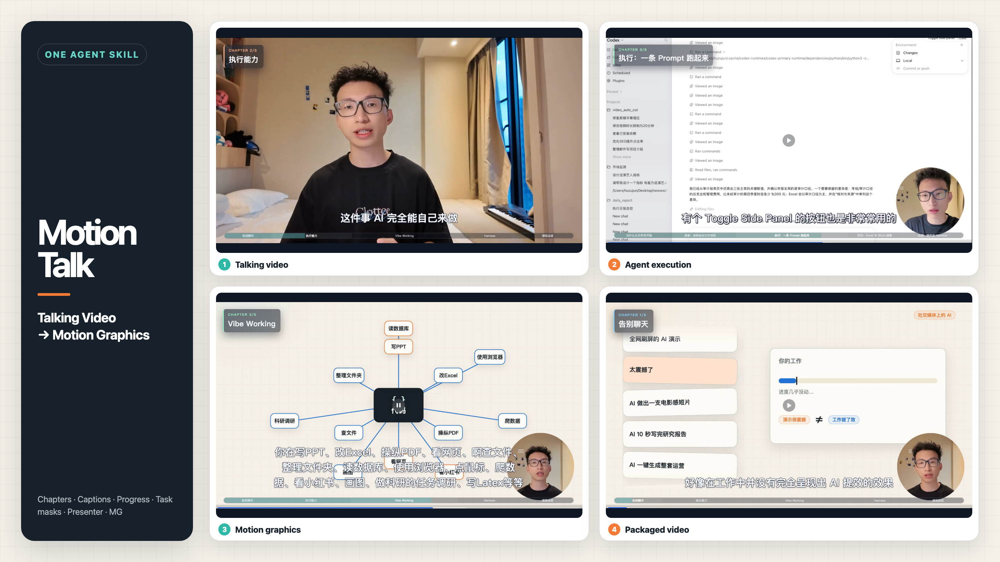
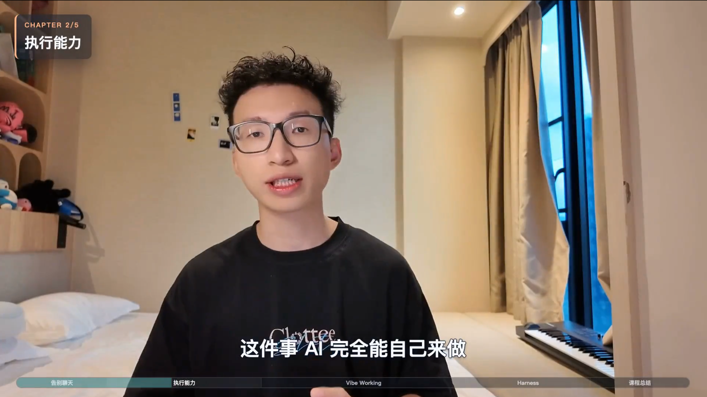
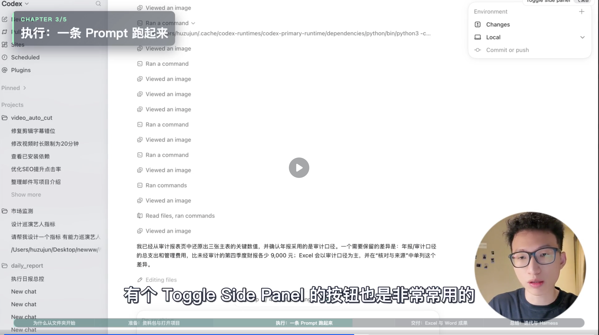
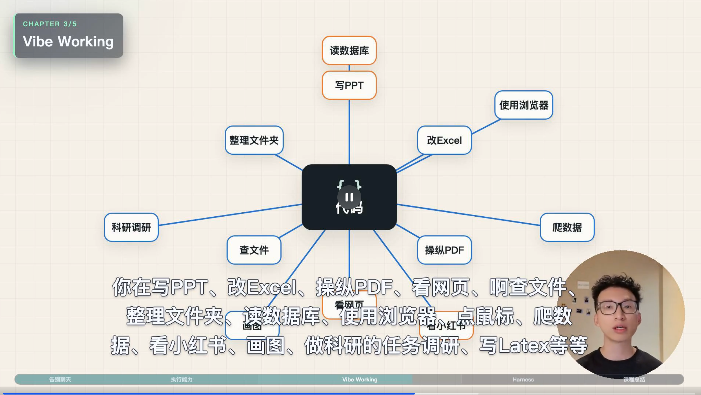
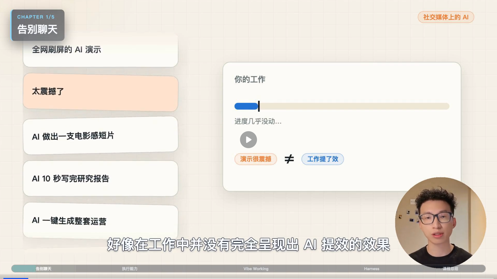

[简体中文](README.md) | [English](README_EN.md)

# MotionTalk

Give MotionTalk one edited selfie talking video and its matching subtitles. If you also recorded the screen while explaining, add the synchronized screen recording. MotionTalk automatically decides when to keep you on screen, show the real operation, or use MG to explain an abstract idea—then delivers a fancy, top-creator-style video with chapters, captions, progress, and task masks.



## One Skill for visual decisions and production

- Keeps the presenter when human presence matters.
- Adds motion graphics when concepts need visualization.
- Switches to synchronized screen recordings for real operations.
- Delivers a packaged video with chapters, captions, progress, task masks, and visual polish.

You do not need to prepare a storyboard or specify every effect. MotionTalk reads the complete video and decides whether each moment belongs with the presenter, the real screen, or motion graphics.

## Input → output

| Input | Required | Contract |
| --- | --- | --- |
| Edited talking video | Yes | The only source of timeline, meaning, and final audio |
| Final SRT | Yes | Must match the edited video timeline exactly |
| Synchronized screen recording | No | Starts at `00:00` and matches the talking video length |

The output is a fully captioned and visually packaged final video. MotionTalk does not run ASR, remove mistakes or pauses, or recut the source video.

The director plan is approved once. After approval, MotionTalk continuously renders the final MG, composites and packages the full video, runs the quality gates, and delivers the result without asking for another “continue delivery” confirmation.

## Two modes

### Single video: talking video ↔ motion graphics

For knowledge videos, opinion pieces, course explainers, and interview clips. MotionTalk controls the rhythm between the original talking video and motion graphics; no screen recording is required.

### Dual video: talking video ↔ screen ↔ motion graphics

For software tutorials, product demos, and workflow breakdowns. MotionTalk protects real on-screen operations first, then decides when to return to the presenter or explain an abstract relationship with motion graphics.

## Complete packaged-video frames

Every image below preserves the complete video frame, including chapters, captions, progress, task masks, presenter framing, and player state.

<p align="center">
  
  
  
  
</p>

## Install

Use the standard Skills CLI:

```bash
npx skills add PoetCoderJun/MotionTalk
```

Or send the repository URL to Codex, Kimi, or another Agent that supports Skills:

```text
Please install MotionTalk:
https://github.com/PoetCoderJun/MotionTalk
```

## Use

Talking video only:

```text
Use $motiontalk with:
- video: /data/talking-video.mp4
- subtitles: /data/final.srt
- output_dir: /work/mg/output
```

With a synchronized screen recording:

```text
Use $motiontalk with:
- video: /data/talking-video.mp4
- screen_video: /data/screen-recording.mp4
- subtitles: /data/final.srt
- output_dir: /work/mg/output
```

### No SRT yet?

First use a separate transcription capability to generate and verify the final SRT for the edited talking video. Then run MotionTalk.

```text
I do not have an SRT yet.
First use an available independent AI transcription capability
to generate /data/final.srt for /data/talking-video.mp4.
Verify that it matches the video timeline, then use $motiontalk with:
- video: /data/talking-video.mp4
- subtitles: /data/final.srt
- output_dir: /work/mg/output
```

## Efficient execution path

This Skill ships reusable scripts for batched MG rendering, chapter overlays, one-pass full-video packaging, and final quality gates, so each project does not rewrite its own execution entry point. The project-specific Remotion visual source still lives inside the user-provided `output_dir`.

Final packaging stays at 60fps. An optional anti-swipe pacing check can apply a 1.15× global speed-up while retiming audio, captions, chapters, and labeled progress together inside the single full-video packaging encode.
