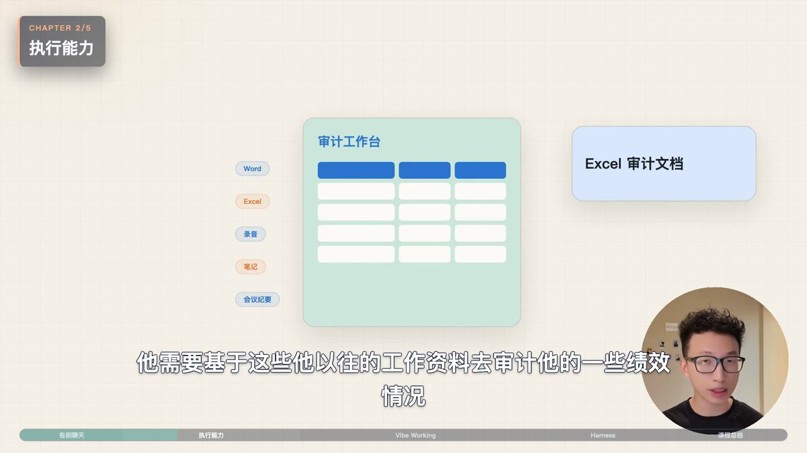
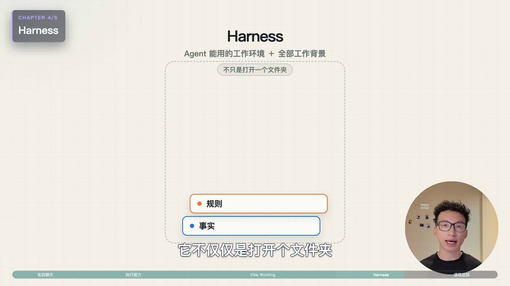

[简体中文](README.md) | [English](README_EN.md)

# talking-mg-video

## I only have one talking-head video. How can I turn it into “top-creator-style” motion graphics with one prompt?

I have an already-edited talking-head video, but watching me speak to the camera from beginning to end feels flat. Key ideas disappear too quickly, processes are explained only with words, and abstract concepts are left entirely to the viewer’s imagination.

Give the finished video and its matching subtitles to `talking-mg-video`. The Agent handles the visual thinking and production: it reads the full content, decides when to keep you on screen, when motion graphics can explain an idea better, and—when a screen recording is available—when to show the real interface. You do not need to prepare a storyboard or specify every effect.

No After Effects skills and no frame-by-frame animation work are required. The Agent turns an ordinary talking-head video into a faster, clearer, more watchable motion-graphics video with the polish of a top creator.

## Use cases

### Standard mode: one selfie video with content-aware MG storyboards

Use this mode for already-edited selfie videos such as knowledge sharing, opinion pieces, course explainers, and interview clips. AI designs motion-graphics scenes from the meaning of each passage and controls the rhythm between the original talking-head footage and MG animation. No screen recording is required.

### Dual-video mode: smooth switching between screen recording, selfie, and MG

Use this mode for software tutorials, product demos, workflow breakdowns, and lessons that include on-screen operations. Provide an equal-length screen recording and talking-head video synchronized from `00:00`. AI decides when viewers should see the real operation, return to the speaker, or switch to MG for an abstract explanation, then plans the transitions between all three sources.

Both modes require a final SRT that matches the timeline of the edited video.

## Example frames

<p align="center">
  
  
</p>

## Installation

Send the following GitHub URL to Codex, Kimi, or another Agent that supports Skills:

```text
Please install this Skill:
https://github.com/PoetCoderJun/talking-mg-video
```

## Usage

Standard mode:

```text
Use $talking-mg-video with:
- video: /data/talking-head.mp4
- subtitles: /data/final.srt
- output_dir: /work/mg/output
```

Dual-video mode:

```text
Use $talking-mg-video with:
- video: /data/talking-head.mp4
- screen_video: /data/screen-recording.mp4
- subtitles: /data/final.srt
- output_dir: /work/mg/output
```

Use standard mode when you only have a selfie video. If you recorded both your screen and yourself, use dual-video mode so AI can plan smooth switching between the screen recording, talking head, and MG animation.

### What if I do not have an SRT?

`talking-mg-video` requires a final SRT. This Skill does not include ASR or subtitle-generation capabilities. If you do not have an SRT, first ask AI to use an independent speech-transcription capability to generate one that matches the edited video. After the subtitles have been generated and verified, pass the SRT path to this Skill.

You can tell the Agent:

```text
I do not have an SRT yet.
First use an available independent AI transcription capability
to generate /data/final.srt for /data/talking-head.mp4.
Verify that it matches the video timeline, then use $talking-mg-video with:
- video: /data/talking-head.mp4
- subtitles: /data/final.srt
- output_dir: /work/mg/output
```

The talking-head video must already be fully edited; this Skill does not remove mistakes, pauses, or repeated takes. The SRT must match the final video timeline. In dual-video mode, the screen recording must be equal in length and synchronized with the talking-head video from `00:00`.
