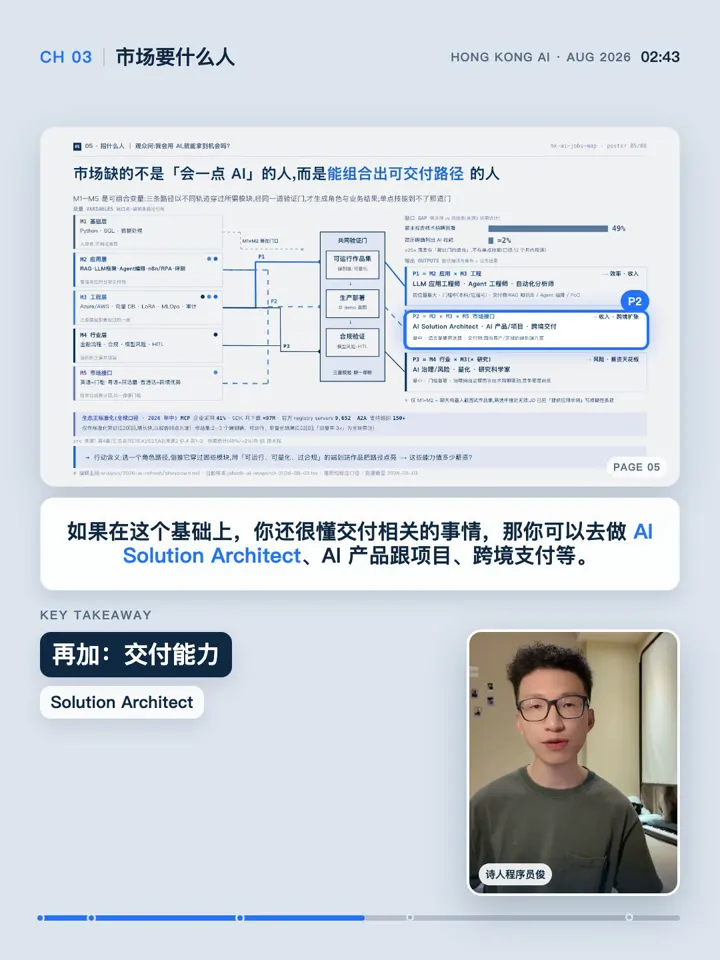

[简体中文](README.md) | [English](README_EN.md)

# MotionTalk

Give MotionTalk an edited talking video and a timeline-accurate final SRT. The
Agent first creates a director prompt. After one approval, it continuously
builds the project-specific Remotion composition, renders evidence frames,
produces the final video, and runs quality gates.

## Core capabilities

- **Content-aware director prompt**: understand the full narration and SRT
  before choosing composition, animation, screen/PPT timing, and semantic
  emphasis for this project instead of applying a fixed template;
- **One approval, continuous delivery**: after director-plan approval, continue
  through implementation, evidence frames, final render, and QA without repeated
  interruptions;
- **One master composition**: one `MasterComposition` packages the visuals while
  source-video audio remains the only audio track, preventing duplicate speech,
  drift, and competing timelines;
- **Efficient local Remotion rendering**: use the project's Remotion packages, a
  version-matched managed Headless Shell, and `75%` concurrency by default;
  enable hardware encoding when available and retain a portable fallback;
- **Semantic quality gates**: capture evidence against approved claims and
  forbidden states, with explicit checks for the longest subtitle, safe zones,
  layout, and final media parameters;
- **Reusable prompt themes**: preserve proportions, hierarchy, and evidence
  rules without cloning a rigid code template; a portrait `PPT Focus Portrait`
  reference is included.

## Sample frames

These frames come from a real 9:16 delivery and show the same theme at the
opening identity treatment, the longest two-line caption, and the closing beat.

<table>
  <tr>
    <td align="center"><br><sub>Opening: PPT focus + lightweight identity type</sub></td>
    <td align="center"><br><sub>Body: self-fitting two-line caption + highlights</sub></td>
    <td align="center"><br><sub>Closing: visual resolution + chapter progress</sub></td>
  </tr>
</table>

## Prompt-first

MotionTalk does not ship a heavy Remotion template or encode composition,
dimensions, progress height, typography ratios, or animation as global modes.

Presenter overlays, full-screen MG with a presenter window, and switching
between presenter and screen recording are prompt-level visual choices. Each
project implements only its approved direction.

```text
Edited video + final SRT
  → Director prompt and semantic invariants
  → One user approval
  → Project-specific Remotion composition
  → Final render + renderStill evidence + quality gates
  → Final packaged video
```

MotionTalk does not run ASR, remove mistakes or pauses, or recut the source.
The input video remains the sole timeline, semantic, and final-audio source.

## Install

```bash
npx skills add PoetCoderJun/MotionTalk
```

## Use

```text
Use $motiontalk with:
- video: /data/talking-video.mp4
- subtitles: /data/final.srt
- output_dir: /work/mg/output
```

Director-plan approval is the only interruption. Render spec, captions,
chapters, progress, layout, safe zones, and animation are frozen in that
project's plan.

## Deterministic thin layer

- `validate_plan.py` validates approval, project render spec, cue coverage,
  visual prompts, and semantic invariants;
- `render_master.mjs` uses official Remotion entry points, defaults to 75% of
  available concurrency, loads Remotion from the project dependencies, uses a
  Remotion-managed browser, and keeps a portable hardware fallback;
- `validate_master.mjs` validates the final video against project data and
  approved evidence.

## Render performance

The default command is portable across macOS, Windows, and Linux. It uses
`75%` concurrency and `if-possible` hardware acceleration. If the device or
execution environment cannot access a hardware encoder, Remotion falls back to
software encoding instead of treating a platform-specific encoder as a
prerequisite.

The renderer loads `@remotion/bundler` and `@remotion/renderer` from the local
project and uses a version-matched, Remotion-managed Headless Shell. The first
run may download that compatible browser. Do not pass a system Chrome path or
delegate browser version management to an external Chrome installation.

## Reusable theme

`PPT Focus Portrait` is a prompt reference for a portrait composition with the
PPT as the primary visual, a self-fitting two-line subtitle rail below it, a
bottom-right presenter, lightweight lower-left display type, and bottom chapter
progress. It preserves proportions and evidence gates without shipping a fixed
Remotion template. See
[`references/04-theme-ppt-focus-portrait.md`](references/04-theme-ppt-focus-portrait.md).

### macOS performance recommendation (optional)

Apple Silicon users can first confirm that FFmpeg exposes VideoToolbox:

```bash
ffmpeg -hide_banner -encoders | grep h264_videotoolbox
```

After verifying that the current terminal can access the system encoder
service, hardware encoding can be made fail-fast with an explicit bitrate:

```bash
node scripts/render_master.mjs \
  --project-dir "$output_dir/remotion" \
  --props "$output_dir/master-props.json" \
  --output "$output_dir/final/video-packaged.mp4" \
  --concurrency 75% \
  --offthread-video-threads 4 \
  --hardware-acceleration required \
  --video-bitrate 16M
```

Use `required` only on a macOS environment where the encoder and permissions
have already been verified. Other platforms, restricted sandboxes, and
unverified machines should keep the default `if-possible` behavior.

## Development

```bash
python3 -m unittest discover -s tests -v
node scripts/render_master.mjs --help
node scripts/validate_master.mjs --help
```

## License

Original repository material is available under
[CC BY-NC-SA 4.0](LICENSE.md) for non-commercial use. Commercial use requires
separate written permission.
