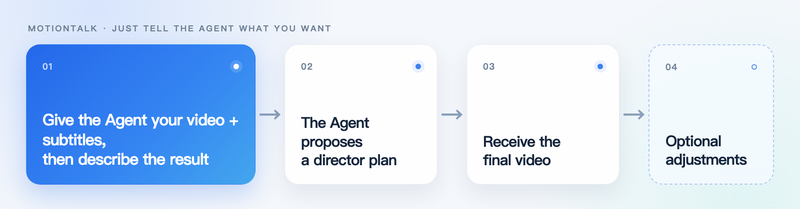
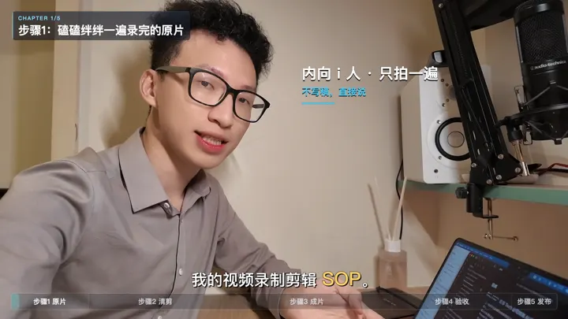
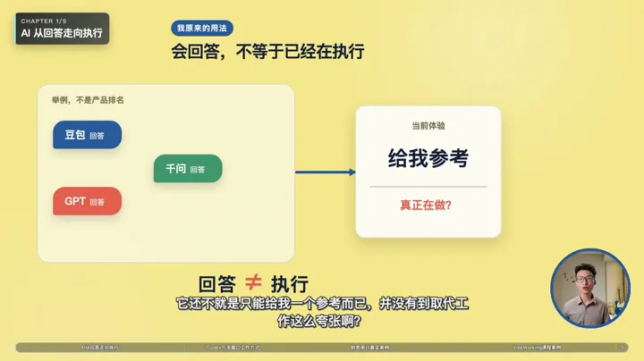
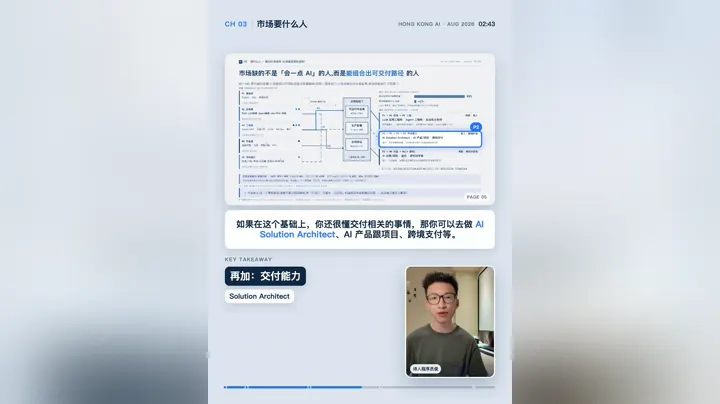

[简体中文](README.md) | [English](README_EN.md)

# MotionTalk

Give an edited video and its final SRT to Codex, Kimi, or Claude Code, then say
a few words about the result you want. MotionTalk reads the content, proposes a
director plan, and completes production after one approval.

## Just tell the Agent what you want

You do not need to understand video engineering or fill in complex parameters.
Give the assets to Codex / Kimi / Claude Code and describe the result as if you
were talking to an editor: landscape or portrait, presenter placement, PPT or
screen recording, caption feel, and any animation you want.

**Give the Agent your video and subtitles, then describe the result → The Agent
proposes a director plan → Receive the final video → Optional adjustments**



For example:

```text
Use MotionTalk for this video and its subtitles. Switch or interweave the
presenter, full-screen MG, and other video B-roll wherever you think it best
serves the content.
```

After approval, the Agent completes production, checks the result, and delivers
the final video. Stop when it feels right, or describe any adjustments in plain
language.

## First run

1. Inspect the four [existing visual samples](#reference-themes) below. They show visual directions, not complete runnable example projects.
2. Prepare a decodable, already-edited video and its final matching SRT. For raw recordings, start with [clean-talking-video](https://github.com/PoetCoderJun/clean-talking-video); MotionTalk does not transcribe or recut.
3. [Install the Skill](#install), then provide both paths and an isolated output directory:

```text
Use $motiontalk with:
- video: /data/edited-video.mp4
- subtitles: /data/final-clean.srt
- output_dir: /work/motiontalk-demo
Use floating-overlay as a reference. Let me review the director plan before approving production.
```

The Agent first delivers a readable director script and a machine plan. Production starts only after explicit approval of the current plan; “use your judgment” authorizes a draft. Changes to inputs, timeline, copy or frozen visual direction require replanning and approval. Delivery includes the packaged video, director script, plan and quality report.

To inspect the engineering without media or model calls, run the [synthetic plan example](examples/plan-validation/README.md). It demonstrates valid, unapproved and gapped plans; it is not a rendered-video demo.

## Reference themes

The four effects below are starting points in one standalone reference prompt.
Naming one can quickly produce a similar video, but they are not a required
four-way choice or the boundary of MotionTalk. Describe the desired layout,
captions, presenter, screen recording, or animation directly in natural
language whenever you want a different result. Every frame is from a real local
delivery.

<table>
  <tr>
    <td width="50%"><br><strong>1. floating-overlay</strong><br><sub>Keep the presenter or recording full-screen and add only lightweight MG in safe zones.</sub></td>
    <td width="50%"><br><strong>2. mg-with-presenter-window</strong><br><sub>Make MG, screenshots, or recordings primary while the presenter remains in a circle or rectangle.</sub></td>
  </tr>
  <tr>
    <td width="50%"><br><strong>3. switching</strong><br><sub>Switch between presenter, full-screen MG, and recordings so each state stays readable.</sub></td>
    <td width="50%"><br><strong>4. PPT Focus Portrait</strong><br><sub>Use PPT as the portrait primary visual, with self-fitting captions below, a bottom-right presenter, and progress.</sub></td>
  </tr>
</table>

All four guides live in
[`references/04-reference-theme-prompt.md`](references/04-reference-theme-prompt.md).
The prompt only helps the Agent understand a direction faster; the final plan
still follows the current assets and natural-language request.

## Core capabilities

- **Understand before designing**: the Agent reads the full video and subtitles
  instead of adding random effects;
- **One approval, continuous delivery**: after the director plan is approved,
  production continues without repeated interruptions;
- **Designed for each video**: visuals follow the content and your request, not
  a fixed template;
- **Checked before delivery**: captions, presenter proportions, occlusion,
  source matching, and the final video are reviewed;
- **Reference-theme prompt**: align quickly with four real examples, or skip
  themes entirely and design the current project in natural language.

## Install

```bash
npx skills add PoetCoderJun/MotionTalk
```

## Checks and limitations

Scripts check plan approval flags, timeline continuity, output dimensions / frame rate / duration, audio codec, and evidence files and statuses in checklists. The Agent still inspects frames for meaning, proportions, occlusion and packaging. Passing checks does not establish automated visual understanding or correctness of every frame.

Approval is a field in the plan, not a signature or input-hash binding. Returning to planning after input changes is a workflow rule. Sampled frames can miss brief defects; output validation also does not prove sample-for-sample identity of the source audio. Missing dependencies, assets or evidence should stop delivery with an explanation.

Full production requires an Agent that can read files and images and execute commands, Python 3, Node.js/npm, and compatible Remotion packages installed in the generated project. The first render may download dependencies and a browser; installing the Skill does not install the full rendering environment. Rendering runs locally, while the chosen Agent service may still process assets. Model charges, performance and turnaround depend on the environment; this repository provides no cost or timing guarantee.

For engineering details, read the [Harness case study and code boundaries](docs/harness-case-study.en.md).

## Development

```bash
python3 -m unittest discover -s tests -v
node scripts/render_master.mjs --help
node scripts/validate_master.mjs --help
```

## License

Original repository material is available under
[CC BY-NC-SA 4.0](LICENSE.md) for non-commercial use. Commercial use requires
separate written permission.
